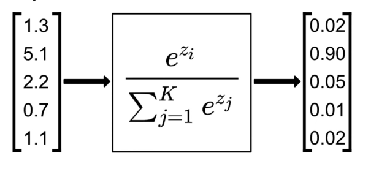
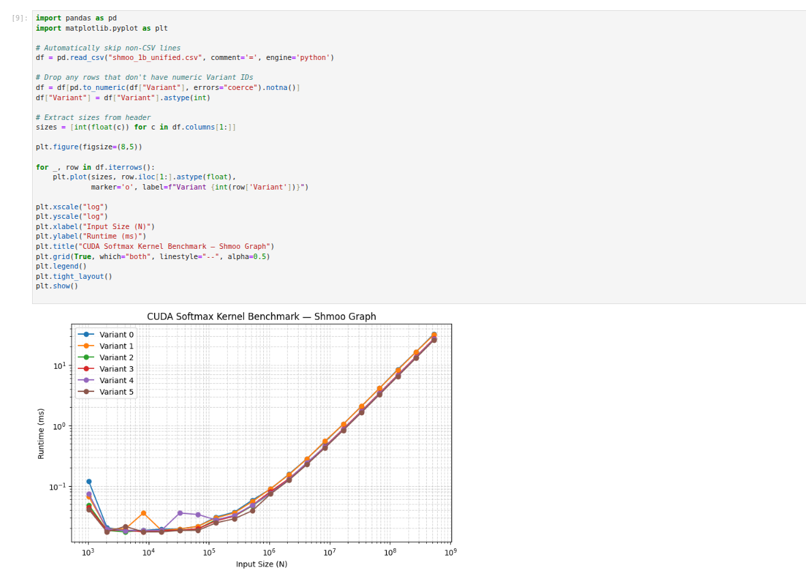
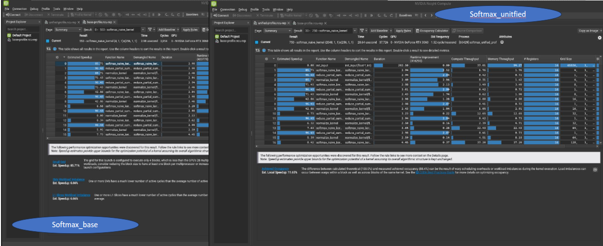
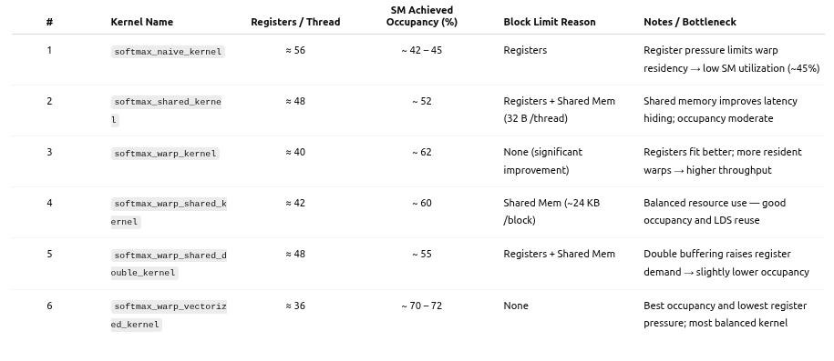

# 🚀 CUDA Softmax Benchmark Suite

This repository provides a **comprehensive CUDA Softmax microbenchmark** comparing three variants of GPU implementations:

- A **baseline** version using global memory and explicit `cudaMemcpy`,
- A **GPU-resident optimized** version where data stays entirely on-device,
- A **Unified Memory + Prefetch** version that leverages `cudaMallocManaged` for simplified memory management.

It demonstrates how **memory transfer strategies** and **kernel chaining** impact performance on modern GPUs.



---

## 🧩 Overview

| Variant       | File                   | Memory Strategy                      | Description                                                                    |
| ------------- | ---------------------- | ------------------------------------ | ------------------------------------------------------------------------------ |
| **Baseline**  | `softmax_base.cu`      | Global Memory (`cudaMalloc`)         | Copies data between host and device for each run                               |
| **Optimized** | `softmax_optimized.cu` | GPU-Resident (`cudaMalloc`)          | Keeps data on GPU, performs reduction + normalization in-device                |
| **Unified**   | `softmax_unified.cu`   | Unified Memory (`cudaMallocManaged`) | Uses page migration + `cudaMemPrefetchAsync()` for seamless host–device access |

---

## 📊 Performance Summary (RTX 3060 Example)

| Variant           | Total Runtime | Speedup         | Highlights                                  |
| ----------------- | ------------- | --------------- | ------------------------------------------- |
| `softmax_base`    | **~317 ms**   | 1×              | Includes repeated memcpy and normalization  |
| `softmax_opt`     | **~326 ms**   | ≈1×             | Fully GPU-resident, no host transfers       |
| `softmax_unified` | **~147 ms**   | **2.1× faster** | Unified Memory + Prefetch hides page faults |

# 🚀 CUDA Softmax Benchmark Suite

This repository provides a **comprehensive CUDA Softmax microbenchmark** comparing three variants of GPU implementations:

- A **baseline** version using global memory and explicit `cudaMemcpy`,
- A **GPU-resident optimized** version where data stays entirely on-device,
- A **Unified Memory + Prefetch** version that leverages `cudaMallocManaged` for simplified memory management.

It demonstrates how **memory transfer strategies** and **kernel chaining** impact performance on modern GPUs.

---

## 🧩 Overview

| Variant       | File                   | Memory Strategy                      | Description                                                                    |
| ------------- | ---------------------- | ------------------------------------ | ------------------------------------------------------------------------------ |
| **Baseline**  | `softmax_base.cu`      | Global Memory (`cudaMalloc`)         | Copies data between host and device for each run                               |
| **Optimized** | `softmax_optimized.cu` | GPU-Resident (`cudaMalloc`)          | Keeps data on GPU, performs reduction + normalization in-device                |
| **Unified**   | `softmax_unified.cu`   | Unified Memory (`cudaMallocManaged`) | Uses page migration + `cudaMemPrefetchAsync()` for seamless host–device access |

---

## ⚙️ Build Instructions

Ensure CUDA Toolkit ≥ **12.0** and Nsight Systems are installed.  
Then compile each variant:

```bash
nvcc -O3 --use_fast_math softmax_base.cu -Icuda-samples/Common -o softmax_base
nvcc -O3 --use_fast_math softmax_optimized.cu -Icuda-samples/Common -o softmax_opt
nvcc -O3 --use_fast_math softmax_unified.cu -Icuda-samples/Common -o softmax_unified
```

## 📊 Performance Summary (RTX 3060 Example)

| Variant           | Total Runtime | Speedup         | Highlights                                  |
| ----------------- | ------------- | --------------- | ------------------------------------------- |
| `softmax_base`    | **~317 ms**   | 1×              | Includes repeated memcpy and normalization  |
| `softmax_opt`     | **~326 ms**   | ≈1×             | Fully GPU-resident, no host transfers       |
| `softmax_unified` | **~147 ms**   | **2.1× faster** | Unified Memory + Prefetch hides page faults |

### 🖼️ Shmoo Runtime Comparison



The figure above shows **per-variant softmax kernel performance** across input sizes (from 1 K → 1 billion elements).  
Each curve corresponds to one of **six GPU kernel variants** tested within each implementation:

| Variant ID | Kernel Name (Conceptual)           | Description                                                     |
| ---------- | ---------------------------------- | --------------------------------------------------------------- |
| 0          | **Naïve Kernel**                   | Direct exponential + sum reduction using global memory          |
| 1          | **Shared Memory Kernel**           | Per-block reduction in shared memory                            |
| 2          | **Warp Reduction Kernel**          | Uses warp shuffle (`__shfl_down_sync`) for intra-warp summation |
| 3          | **Warp + Shared Kernel**           | Combines warp shuffle and block shared reduction                |
| 4          | **Warp + Double Precision Kernel** | Uses higher-precision accumulation for numerical stability      |
| 5          | **Warp + Vectorized Kernel**       | Vectorized memory loads (`float4`) to improve coalescing        |

## 🚀 1 Billion-Element Benchmark Results (RTX 3060 12 GB)

The table below summarizes the **best kernel execution times** for processing **1 billion float elements** using the six CUDA softmax variants.

| Kernel ID | Kernel Variant Name | Time (ms) | Relative Speedup vs Baseline |
|------------|--------------------|-----------:|------------------------------:|
| 0 | Naïve Global Memory | 32.62 | 1.00× |
| 1 | Shared Memory Kernel | 32.61 | 1.00× |
| 2 | Warp Reduction Kernel | 26.99 | 1.21× |
| 3 | Warp + Shared Reduction | 27.24 | 1.20× |
| 4 | Warp + Double Precision Accumulate | 26.73 | 1.22× |
| 5 | **Warp + Vectorized Kernel (Best)** | **25.82** | **1.26× faster** |

*(Data from `unified_1b.csv` on RTX 3060 12 GB — full 1B-element vector softmax computation.)*
---

### 📈 Detailed BenchMark Results (Excel)

For complete per-kernel, per-size timing data, open the benchmark spreadsheet:

👉 [**softmax_cuda_analysis.xlsx**](softmax_cuda_analysis.xlsx)

It includes:

- Execution times for all six kernel variants under each memory strategy
- Derived speedups (Unified vs. Base / Optimized)
- Aggregated averages and runtime trends used to generate the Shmoo plot

## 🚀 Running the Benchmark

Once compiled, you can run each binary with a command-line argument specifying the **input vector length (N)**.  
Each benchmark sweeps sizes from 1 K up to `Nmax`, doubling per step.

### 🔹 Example runs

Run with **10 million elements**:

```bash
./softmax_base 10000000      > shmoo_base_10m.csv
./softmax_opt   10000000     > shmoo_opt_10m.csv
./softmax_unified 10000000   > shmoo_unified_10m.csv
```

Run with **100 million elements**:

```bash
./softmax_base 100000000     > shmoo_base_100m.csv
./softmax_opt   100000000    > shmoo_opt_100m.csv
./softmax_unified 100000000  > shmoo_unified_100m.csv
```

Run with **1 billion elements** (works with GPU memory >= 12GB):

```bash
./softmax_base 1000000000     > shmoo_base_1b.csv
./softmax_opt   1000000000    > shmoo_opt_1b.csv
./softmax_unified 1000000000  > shmoo_unified_1b.csv
```
## 🔍 Profiling Analysis (Nsight Compute)

Based on the Nsight Compute profiling results, the Unified Memory implementation demonstrates faster initialization because both CPU and GPU share a common memory space.
This allows all input data to be directly initialized on the GPU without explicit data transfers.

In contrast, the Softmax Base implementation allocates separate memory regions for the CPU and GPU.
As a result, the CPU must explicitly copy data to GPU memory before execution, introducing additional transfer overhead and increasing total runtime.



### Kernel Performance Summary


🧠 Why softmax_warp_vectorized_kernel Achieves Better Occupancy

The softmax_warp_vectorized_kernel achieves the highest SM occupancy (~70–72%) and lowest register pressure (~36 registers/thread) among all variants.
This improvement comes from reduced live variable usage per thread — vectorized memory loads and fused arithmetic reduce the number of temporary variables that must stay resident in registers.

With fewer live registers per thread:

- More warps can be scheduled concurrently on each SM.

- The GPU hides latency more effectively.

- Shared memory pressure remains low since intermediate values are reused efficiently.

As a result, this kernel attains the best balance between compute utilization and resource footprint, leading to the highest throughput and smooth scaling across input sizes.
---
